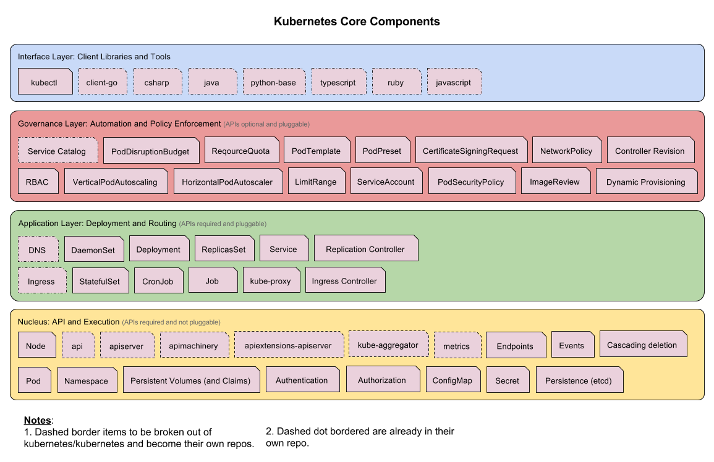
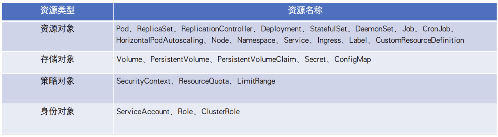

# 简介
kubernetes 已经成为容器云平台的标准，它提供自动部署、扩充、管理容器化应用服务。

## 基本概念
+ 容器
    - linux namespace、linux cgroups、rootfs
    - 容器运行时、容器镜像
+ kubeadm
    - kubeadm init
    - kubeadm join
    - kubelet / kubectl / kubeadm
    - port: 10250/10251/10252
    - /etc/kubernetes/pki

+ pod
    - kubernetes 最小 API 对象，原子调度单位
    - 一组对等关系的容器，共享某些资源
    - infra 容器，k8s.gcr.io/pause
    - init Container
    - sidecar 模式
    - 日志收集 /var/log
    - <a href="./pdf/design_patterns_for_container_based_distributed_system.pdf" title="容器设计模式">容器设计模式论文</a>
    - 调度、网络、存储、安全等属性
    - image、command、workingDir、Ports、volumeMounts
    - status: Pending、Running、Succeeded、Failed、Unknown
    - Projected Volume: Secret、ConfigMap、Downward API、ServiceAccountToken
    - Secret

### 容器
容器镜像: 以容器为交付物，部署于 kubernetes 平台上，进行升级、回滚、扩容、收缩等操作。
停止等待时间(preStop Hook): k8s 中为了确保优雅停止，停止 pod 进程前，先等待网关或服务注册中心删除这个服务，使得流量不会受到影响，达成优雅停止。配置 preStop Hook, 使得 Pod 真正销毁前先 sleep 一段时间，留出时间给 Endpoint controller 和 kube-proxy 更新 Endpoint 和转发规则。
CPU/内存资源分配: 容器 pod 分配的可用资源。
容器健康度检查: 用于检测容器是否存活，如果容器存活检查失败，会对容器执行重启。就绪检查、端口检查、HTTP 请求检查、执行命令检查检查。
实例数量: kubernetes 中, 一个业务的 pod 数量.
Service: 一组 pod 进行负载均衡, k8s 提供默认的 service , 也可以考虑其它的服务注册、发现、负载均衡的组件支持。

### 组件
kubernetes 核心组件如下:
- etcd: 保存了整个集群的状态.
- API Server: 提供了资源操作的唯一入口, 并提供了认证、授权、访问控制、API 注册和发现等机制.
- Controller Manager: 负责维护集群的状态，如故障检测、自动扩展、滚动更新等.
- Scheduler: 负责资源的调度，按照预定的调度策略将 Pod 调度到相应的机器上.
- Kubelet: 负责维护容器的生命周期，同时也负责 Volume(CVI) 和网络(CNI)的管理.
- Container Runtime: 负责镜像管理以及 Pod 和容器的真正运行(CRI).
- Kube-proxy: 负责为 Service 提供 Cluster 内部的服务发现和负载均衡.

Workloads:
- ReplicaSet: 容器副本
- Deployment: 常规作业
- DaemonSet: Daemon 作业
- StatefulSet: 有状态任务
- Job: 一次性任务
- CronJob: 定时任务

## CRD 
Custom Resource Definition 是 k8s 中的特殊资源, 它相当于 k8s 中的一个数据库表. 是 k8s 为提高可扩展性, 让开发者自定义资源的一种方法.
- k8s 内置资源
    + 资源对象: 常用的有 Pod、ReplicaSet、Deployment、Job、Node、Namespace、Service、Label、CustomResourceDefinition 等
    + 存储对象: Volume、PersistentVolume、Secret、ConfigMap 等
    + 策略对象: SecurityContext、ResourceQuota、LimitRange 等
    + 身份对象: ServiceAccount、Role、ClusterRole 等

## Operator
Operator 可以看成是 CRD 和 Controller 的一种结合机制. Operator 是一种特定于应用的控制器, 可以扩展 Kubernetes API 的功能, 来代表 Kubernetes 用户创建、配置和管理复杂应用的实例.

## 实践问题
1. k8s 的二次开发 operator、crd、aa 等？
2. k8s 的开源项目二次开发?
3. kubelet、containerd、apiserver、coredns 问题处理?
4. k8s 及存储系统?

## 云原生
云原生技术生态当前覆盖了容器运行时、网络、存储和集群管理、可观测性、弹性、DevOps、服务网格、无服务架构、数据库、数据仓库等方方面面.
- GPU 集群
    + 用 kubernetes、kubeflow、nvidia-docker 可以快速搭建 GPU 集群, 实现 AI 作业调度和 GPU 资源分配
    + GPU 利用率优化
    + 分布式扩展性、作业弹性扩展、实时日志、监控、可视化
- 云原生 AI 平台
    + 异构资源: 对计算资源如 CPU、GPU、NPU、VPU、FPGA、ASIC, 存储资源 OSS、NAS、CPFS、HDFS, 网络资源 TCP、RDMA 进行抽象
    + 计算引擎: 将 TensorFlow、Pytorch、Horovod、ONNX、Spark、Flink 等开源或自研的计算引擎标准化

## 资料
1. [图解 Kubernetes Pod 创建流程](https://www.yuque.com/baxiaoshi/tyado3/bl6lev)
2. [kubernetes 最佳实践: 优雅终止](https://imroc.cc/post/202106/graceful-shutdown/)
3. [CRD 就像 Kubernetes 中的一张表！](https://zhuanlan.zhihu.com/p/260797410)
4. [摆脱 AI 生产“小作坊”：如何基于 Kubernetes 构建云原生 AI 平台](https://developer.aliyun.com/article/890115)
5. [k8s常见的资源对象使用](https://www.cnblogs.com/cyh00001/p/16555344.html)
