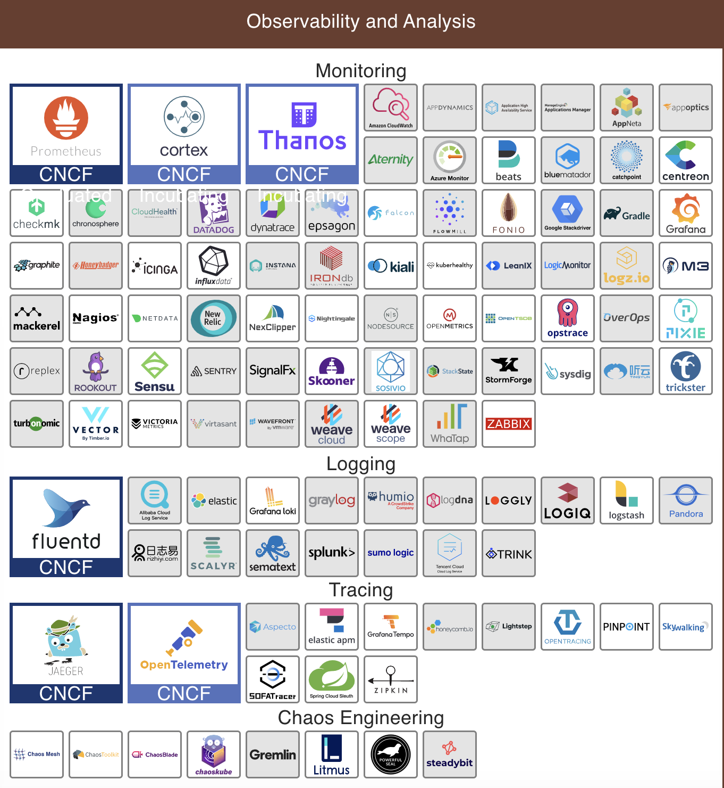

# 简介
可观测性是一种用于衡量系统内部状态的能力。在分布式系统中，可观测性能力包含度量(Metrics)、日志(logs)和追踪(traces)。
在可观测性的发展过程中，从数据采集、分析、存储到展示涌现了一批优秀的工具，它们各有优缺点，满足不同场景。但是由于不同规范等原因，导致工具互相不能通用。这也催生出了开源中立的 OpenTracing、OpenTelelemtry 产生。

## CNCF 可观测性项目
在 CNCF 的可观测性项目中，就有许多在 Monitoring、Logging、Tracing 等相关的项目。下图是目前 CNCF 中可观测性相关的项目，包括 Prometheus、Zabbix、Fluentd、Elastic、Grafana、Logstash、Skywalking 等常用工具。

## OpenTelemetry
OpenTelemetry 是一个开源中立的项目，致力于提供一个业界通用的可观测性工具、接口、SDK 的集合。

## 数据可观测性
Data Observability 数据可观测性帮助理解系统的健康状态, 帮助接近实时的鉴别和解决问题.

- 数据治理: 数据治理(Data Governance) 是一组标准和准则. 旨在维护整个数据管道的数据质量. 由于 AI 和 ML 等新兴技术严重依赖于作为变量的数据, 验证数据的质量至关重要. 数据治理帮助设定一个可观测性的框架,
## 参考
1. [一文看懂"数据治理"和"可观测性"](https://zhuanlan.zhihu.com/p/572937824)
2. [Data Governance and Observability](https://www.kdnuggets.com/2022/08/data-governance-observability-explained.html)