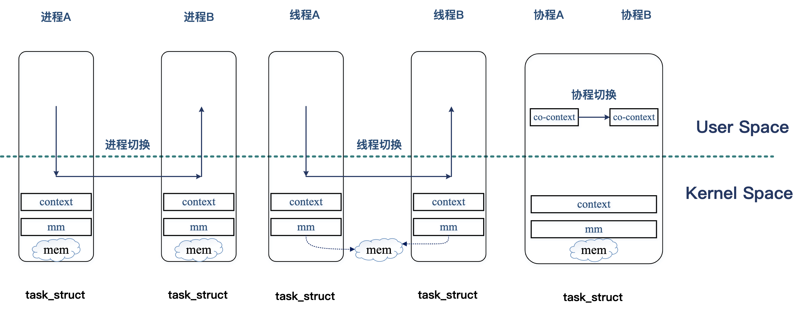

# 简介
libco 是微信开源的 c++ 协程库。2013 年开源在 github 上 https://github.com/Tencent/libco，至今已经运行在了数万台微信后台的机器上。

## 协程
协程，又称微线程，英文名(Coroutine)。协程的概念很早就有，但是近年在 go 、lua 等语言兴起后，才开始被广泛应用。协程可以用于完成并发，它比线程更加轻量级，不同于线程和进程，它不是由操作系统进行调度的，协程的切换不需要进入内核态，它是由用户态进行调度切换的，这也让协程的切换消耗更小。

## libco demo
多线程并发模式中，经典的模型就是生产者消费者问题。下面是使用 libco 的 协程处理生产者消费者问题的样例代码。代码来自 https://github.com/tencent-wechat/libco/blob/master/example_cond.cpp

        struct stTask_t {
            int id;
        };
        
        struct stEnv_t {
            stCoCond_t* cond;
            queue<stTask_t*> task_queue;
        };
        
        void* Producer(void* args) {
            co_enable_hook_sys();
            stEnv_t* env = (stEnv_t*)args;
            int id = 0;
            while (true) {
                stTask_t* task = (stTask_t*)calloc(1, sizeof(stTask_t));
                task->id = id++;
                env->task_queue.push(task);
                printf("%s:%d produce task %d\n", __func__, __LINE__, task->id);
                co_cond_signal(env->cond);
                poll(NULL, 0, 1000);
            }
            return NULL;
        }
        
        void* Consumer(void* args) {
            co_enable_hook_sys();
            stEnv_t* env = (stEnv_t*)args;
            while (true) {
                if (env->task_queue.empty()) {
                    co_cond_timedwait(env->cond, -1);
                    continue;
                }
                stTask_t* task = env->task_queue.front();
                env->task_queue.pop();
                printf("%s:%d consume task %d\n", __func__, __LINE__, task->id);
                free(task);
            }
            return NULL;
        }

        int main(){
            stEnv_t* env = new stEnv_t;
            env->cond = co_cond_alloc();

            stCoRoutine_t* consumer_routine;
            co_create(&consumer_routine, NULL, Consumer, env);
            co_resume(consumer_routine);

            stCoRoutine_t* producer_routine;
            co_create(&producer_routine, NULL, Producer, env);
            co_resume(producer_routine);

            co_eventloop(co_get_epoll_ct(), NULL, NULL);
            return 0;
        }

### libco 函数
上述生产者、消费者模型中，包括多个 libco 的函数。它们的主要作用如下:
- co_create() 函数是协程创建函数。
- co_resume() 切换到指定的协程 co, 操作系统对协程是无感知的，切换调度由协程自己完成
- co_eventloop() 主协程的调度函数, 主要作用是通过 epoll 负责各个协程的时间监控，如果网络事件到了或者等待时间超时, 就切换到对应的协程处理。
- co_enable_hook_sys() 函数用来打开 libco 的钩子标示。
- poll() 函数相当于 sleep() 函数， sleep() 函数是作用域线程的。而 poll() 函数则是作用于协程的挂起。
- 涉及到同步接口如下:
    - co_cond_alloc
    - co_cond_signal
    - co_cond_broadcast
    - co_cond_timedwait
- libco 中的信号量函数:
    - co_cond_free
    - co_cond_signal: 用于通知等待的协程条件已经就绪。将等待的协程的超时对象从当前线程环境的 timeout 队列移除加入 active 列表，使得等待的协程在下一个 event_loop 的处理周期就能触发。
    - co_cond_broadcast: 同 co_cond_signal, 它用于广播通知所有协程。
    - co_cond_timedwait: 用于进行信号量的等待, 这是通过在 pEpoll 的 timeout 链表中加入一个 timeout 的 item 来实现超时触发，同时将 cond item 加入信号量所在的链表，然后使用 co_yield_ct 让出时间片。当发生超时触发时，调用 OnSignalProcessEvent 将协程环境恢复。

### libco 库原理与实现
libco 框架可以分为三层, 分别是接口层、系统函数 Hook 层及事件驱动层。
- 接口层: 主要提供协程原语、协程信号量、协程私有变量等。
- 系统函数 Hook 层: 将一些相关的系统函数替换为自己的实现，包括 socket 族函数、gethostbyname、setenv/getenv 等
- 事件驱动层: Linux 平台下主要是封装 epoll 相关的接口。

### epoll

#### 调度
libco 是一个典型的非对称协程机制，严格意义上，不存在调度器。在执行 yield 时，当前协程只能将控制权交给调用者协程。它的调度主要基于 epoll/kqueue 的事件驱动调度，调度就是 epoll/kequeue 的事件循环。

## 参考
1. [微信 libco 开源库](https://github.com/Tencent/libco)
2. [微信开源C++Libco介绍与应用（一）](https://zhuanlan.zhihu.com/p/51078499)
3. [一文读懂什么是进程、线程、协程](https://www.cnblogs.com/Survivalist/p/11527949.html#%E5%8D%8F%E7%A8%8B)
4. [DevOps Libco](https://www.dazhuanlan.com/s_dom_may/topics/1189780)
5. [libco 协程库原理与实现](http://cs-cjl.com/2019/05_16_libco_principle_and_impl)
6. [libco源码阅读（五）：协程调度——时间轮](https://blog.csdn.net/MOU_IT/article/details/115030626)
