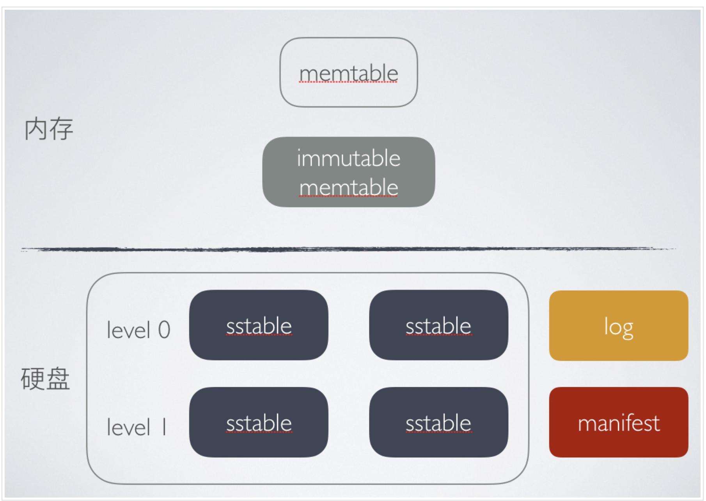

# 简介
ClickHouse 是一个开源列式数据库管理系统(DMBS), 数据在 ClickHouse 中始终是列式存储的. 它用于实时数据分析, 处理速度比传统方法快 100-1000 倍.

## 概念
- **列式存储**: Online Analytical Processing, OLAP 将数据的每一列组织在一起, 大大减少在进行聚合计算时候磁盘 I/O 次数, 但在写入时要多次 I/O.
- **行模式存储**: Online Transaction Processing, OLTP 数据基于行存储, 数据的写入快, 但对于需要大量聚合统计数据的需求效率并不高.
- **列**: 表示内存中的列, 需使用 IColumn 接口.
- **字段**: 用于表示单个值.
- **抽象漏洞**: Leaky Abstractions, IColumn 拥有常见的用于关系型数据转换的方法.
- **数据类型**: IDataType 负责序列化和番序列化.
- **块**: Block 表示内存中的表的子集的容器.
- **块流**: 快流用于处理数据.
- **格式**: 有用于向客户端输出数据的格式等, 如 Pretty、TabSeparated、JsonEachRow 等, 还有行流 IRowInputStream 等.
- **I/O**: 用于面向字节的输入输出, ReadBuffer、WriteBuffer 抽象类.
- **表**: 又 IStorage 接口表示, , 如 StorageMergeTree、StorageMemory 等.
- **解析器**: Parsers 是一个手写递归下降解析器, 用于解析查询
- **解释器**: 负责创建 AST 查询执行流水线.
- **函数**: 有普通函数和聚合函数. 函数作用在以 block 为单位的数据上, 以实现向量查询执行.
- **聚合函数**: 是状态函数, 它们将传入的值激活到某个状态, 并允许从该状态获取结果. 使用 IAggregateFunction 进行管理.
- **服务器**: Server 实现了多个不同的接口. 用于外部客户端的 HTTP 接口、用于本机 Clickhouse 客户端及分布式查询的 TCP 接口、用于传输数据进行拷贝的接口.
- **合并树**: MergeTree 是一系列支持按主键索引的存储引擎.
- **复制**: 基于表实现的复制, 可以在同一个服务器上有可复制的表和不可复制的表.

### 架构
ClickHouse 的主要组件包括 Client、Server、Storage、Distributed、ZooKeeper、Replication .
- **Client**: 用于与 ClickHouse 服务器进行通信, 向其发送查询请求.
- **Server**: 服务器, 是 ClickHouse 的核心组件, 负载接受来自客户端的查询请求, 将结果返回给客户端.
- **Storage**: 存储, ClickHouse 支持多种存储引擎, 包括 MergeTree、Collapsing 等.
- **Distributed**: 支持分布式部署, 可以用多个节点组成一个 ClickHouse 集群, 提高系统的可用性和性能.
- **Zookeeper**: 是一个分布式的协调服务, ClickHouse 可以通过 Zookeeper 实现集群节点的发现和管理.
- **Replication**: ClickHouse 支持数据复制, 可以将数据从一个节点复制到其他节点, 提高系统的可用性和数据的容错性.

### MergeTree
MergeTree 是 ClickHouse 最有特色、功能最强大的表引擎, 实现了数据的 partitioning、replication、mutation、merge 并在 merge 基础上的 replace、aggregation. 

#### LSM Tree
LSM Tree 全称 Log-Structured-Merge Tree, 即日志结构合并树, 它是一种数据结构设计思想。许多 NoSQL 存储采用的都是 LSM 树如 LevelDB、Hbase、RocksDB 等. 被设计用来提供比传统 B+ 树或 ISAM 更好的写操作吞吐量, 主要是通过消除本地随机更新操作.
LSM Tree 由两个或以上的存储结构组成. 

#### SSTable
SSTable(Sorted String Table)是排序字符串表的简称, 它是一个高效的 key-value 型文件存储格式. 它目前已经被广泛用于常用的一些存储引擎如 BigTable、Cassandra、Hbase、RocksDB、LevelDB 等 key-value 型存储引擎中. 

### 索引
ClickHouse 的索引有 Sparse Index、Skip Indexes
- Sparse Index: 稀疏索引针对表中部分数据建立索引项目, 为每个表中数据块建立一个索引项. 
- Skip Indexes: ClickHouse 提供了跳数索引能够显著的提高查询速度.

## 性能
相比于 MySQL、InfluxDB, ClickHouse 在同样的资源情况导入速度、磁盘占用、查询性能方面都十分突出. 
- 4c16g 的资源, 官网 6600w 数据集, 导入耗时约 75 秒、磁盘空间 2.7G、全表 count 100 ms、 max/min 186ms、平均值 123ms、方差 113ms.
- clickhouse 快的原因: 列式存储、数据压缩、向量化执行引擎、多线程和分布式、多样的表引擎(MergeTree)、稀疏索引.
- clickhouse 缺点: 不支持事务、不支持真删除/更新、分布式能力弱、不支持高并发(建议 QPS 100).

## RocksDB
RocksDB 是由 facebook 基于 LevelDB 开发的一款提供键值存储与读写功能的 LSM-tree 架构引擎. 用户写入的键值对会先写入键盘上的 WAL(Write Ahead Log), 然后在写入内存中的跳表(SkipList, 这部分结构称作 MemTable).

+ LevelDB: 一个持久化存储的 Key-Value 型数据持久化存储 C++ 程序库、大部分数据存储在磁盘上、能够处理十亿级规模 key-value 数据
    - SSTable: 即 Sorted String Table 有序的固化表文件 . LevelDB 的不同层级用很多 SSTable 文件. 分位数据存储区和数据管理区. 由于 key 是有序的, 就可以用二分查找高效的读取磁盘数据了.
    - Memtable: 内部是一个 key 有序的 SkipList 列表
    - Immutable Memtable: 当 Memtable 的数据占用内存到了一个阈值, LevelDB 会生成新的 log 文件和 MemTable, 原来的 MemTable 变成 Immutable Memtable. Immutable Memtable 会导出磁盘变成新的 SSTable 文件.
    - SkipList: 包含多个指针的链表, 它可以比链表更快速的查询一个有序元素的数据链表.
    - LSM Tree: 全名 Log Structured-Merge Tree. 它是针对写入速度瓶颈问题提出的, 将随机写变成顺序写. 核心思想是通过对变更进行批量、延迟的处理, 通过归并排序将更新迁移到硬盘上. LevelDB 基于 memtable + sstable 实现 LSM Tree.
    - 写入过程:
        1. 将记录以顺序方式追加到 log 文件末尾, 由于是顺序写入磁盘，效率相对较高
        2. 将 kv 记录插入内存中的 Memtable 中
    - 读取过程: 
        1. 内存读取: 首先去内存中的 Memtable 中寻找 key-value. 如果 Memtable 中没有，则去 Immutable Memtable 中读取.
        2. 磁盘读取: 若在内存中没有找到指定 key-value, 则去磁盘中的 SSTable 中寻找. 首先从 level 0 的文件中查找, 然后去 level 1 文件中查找, 直到在某层 SSTable 中找到 key-value.
    - Compaction 操作: leveldb 采取 compaction 方式对已有记录进行压缩, 通过这种方式删掉一些不再有效的 KV 数据, 减少数据规模、文件数量等. 从内存中 dump 出的文件称为 level 0 层, 后期整合的为 level i 层.
        + minor compaction: 是将 Immutable 持久化到 level 0 层的过程.
        + major compaction: 负责将 sstable 进行合并, 每合并一次, sstable 中的数据就落到更底一层, 数据慢慢被合并到底层 level, 这样的好处是可以清理冗余数据, 节省磁盘空间.
            - 触发时机: level 0 层的 sstable 文件超过指定个数. level i 层的 sstable size 总大小超过 10^i MB.
            - compactioon 流程: 选择合适的 level 及 sstable 文件用于合并、根据 key 重叠情况扩大输入文件的集合、多路合并选出的文件集合

## 参考
1. [什么是列式存储，一文秒懂](https://juejin.cn/post/6844904118872440840)
2. [github - ClickHouse/ClickHouse](https://github.com/ClickHouse/ClickHouse)
3. [ClickHouse 架构概述](https://clickhouse.com/docs/zh/development/architecture)
4. [记一次 ClickHouse 性能测试](https://juejin.cn/post/7131778389865660452)
5. [ClickHouse教程](https://clickhouse.com/docs/zh/getting-started/tutorial)
6. [Clickhouse数据存储结构](https://www.cnblogs.com/eedbaa/p/14512803.html)
7. [CSDN - 密集索引（dense index）和稀疏索引（sparse index）](https://blog.csdn.net/tuning_optmization/article/details/114361513)
8. [HBase|ClickHouse|MongoDB都在用LSM-Tree存储原理](https://blog.csdn.net/huzechen/article/details/107478781)
9. [RocksDB 简介](https://docs.pingcap.com/zh/tidb/dev/rocksdb-overview)
10. [常用NoSQL的分析与比较](https://z.itpub.net/article/detail/BD77F3028C01D6157CA9752B628620F5)
11. [06| LevelDB读操作](https://zhuanlan.zhihu.com/p/458197881)
12. [leveldb-handbook 基本概念](https://leveldb-handbook.readthedocs.io/zh/latest/basic.html)
13. [LevelDB之LSM-Tree](https://zouzls.github.io/2016/11/23/LevelDB%E4%B9%8BLSM-Tree/)