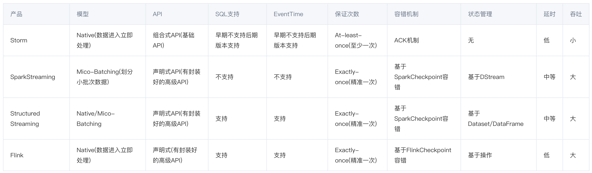
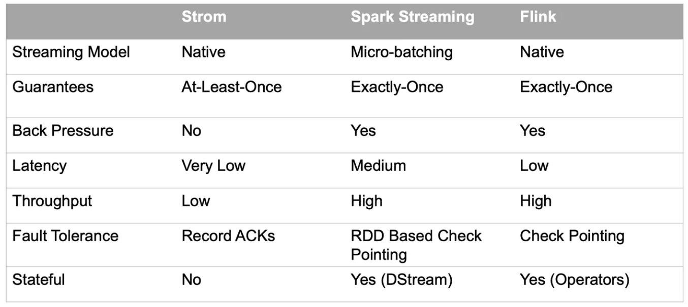
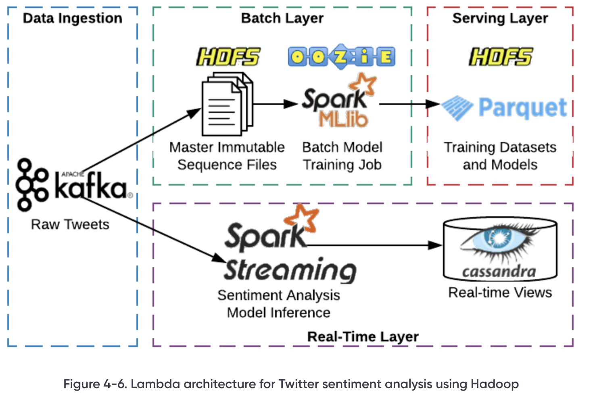
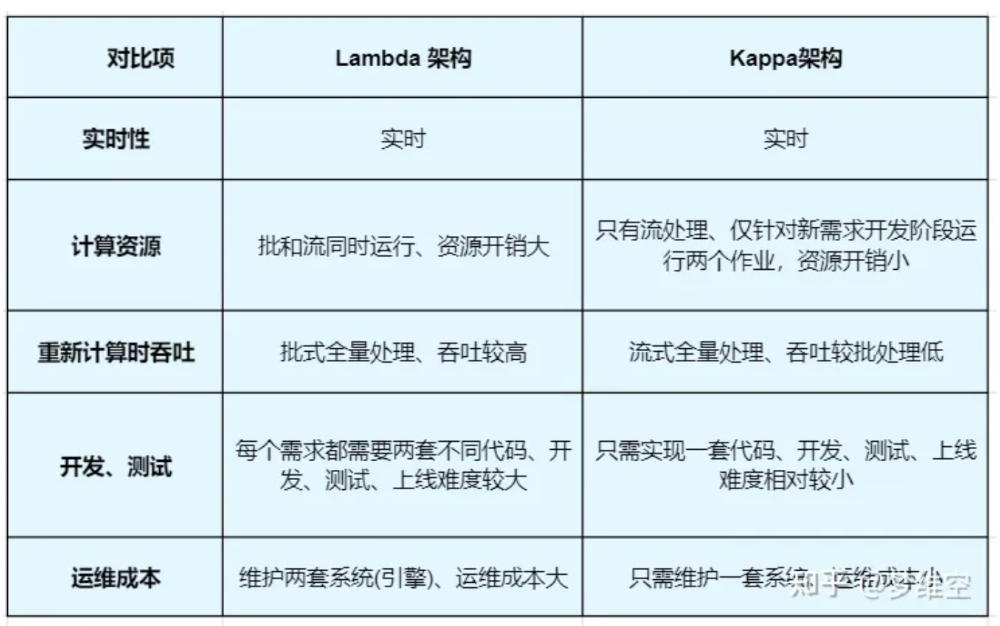

# 简介
Apache Flink 是一个框架和分布式处理引擎, 用于在无边界和有边界数据流上进行有状态的计算.

## 概念
+ 处理有界和无界数据
    - 有界流: 有定义流的开始，也有定义流的结束. 可以在摄取所有数据后再进行计算. 有界流处理通常被称为批处理.
    - 无界流: 有定义流的开始，没有定义流的结束. 会无休止的产生数据, 无界流的数据需要持续处理.
+ 易部署: 集成了常见的资源管理器, 如 Hadoop YARN、Apache Mesos 或 kubernetes, 同时也可以作为独立集群允许.
+ 大规模: Flink 可以方便的扩展到大规模集群中. 用于维护万亿级事件、TB 大小的状态, 允许在千万级内核上, Flink 将任务并行化为数千个子任务, 充分利用集群的 CPU、内存、磁盘和网络资源.

## Flink 架构
Flink 主要针对实时计算领域处理流数据, 在此之前还有 Storm、SparkStreaming 等. 下面是几个实时计算框架的对比: 

- JobManager: 负责整个 Flink 集群任务的调度及资源管理, 从客户端获取提交的应用, 然后根据集群中 TaskManager 上 TaskSlot 的使用情况, 为提交的应用分配 TaskSlot 资源并命令 TaskManager 从客户端获取的应用.
- TaskManager: 相当于集群的的 Slave 节点, 负责具体的任务执行和对应任务在每个节点上的资源申请和管理.
- Client 客户端: 负责将任务提交到集群, 与 JobManager 构建 Akka 连接, 然后将任务提交到 JobManager, 通过和 JobManager 之间进行交互获取任务执行的状态.

## 流式框架

## 数据仓库架构
海量数据分析的技术架构经历了多个演进历程，从小时级发展到亚秒级。
### Lambda 架构
Lambda 架构(Lambda Architecture) 是由 Twitter 工程师南森·马茨提出的大数据处理架构. Lambda 架构使开发人员能够构建大规模分布式数据处理系统。它具有很好的灵活性和可扩展性，对硬件故障和人为失误有很好的容错性。

Lambda 架构由三层系统组成:
- 批处理层: Batch Layer, 存储管理主要数据集(不可变的数据集)和预先处理计算好的视图.
- 速度处理层: Speed Layer, 实时处理新来的大数据.
- 服务层: Serving Layer, 在批处理层和速度处理层处理完的结果都输出存储在服务层中, 服务层通过返回预先计算的数据视图或从速度层处理构建好数据视图来响应查询.

### kappa 架构
Lambda 架构满足了实时的需求，但带来了许多开发和运维工作。随着 Flink 等流处理引擎的出现，流处理技术变成熟了，LinkedIn 的 Jay Kreps 提出了 Kappa 架构, 它简化了 Lambda 架构

## 近线系统
通常将系统分位在线系统和离线系统，近线系统则介于二者之间，有时效性要求但为在线系统提供已经计算好的离线数据。近线系统的主要目的是实时、快捷的挖掘热点事件，并输出热点事件特征供上层应用使用。

## flink 问题
1. Flink 的应用架构? JobManager 和 TaskManager 作用?
2. Flink 的压测和监控?
3. 为什么用 Flink 而不用 Spark?
    - Flink 的低延时、高吞吐量和对流式数据应用场景支持的更好.
    - Spark 采用的是 RDD 模型、Flink 基本数据模型是数据流以及事件 Event 序列
    - Spark 是批计算、Flink 是标准的流执行模式
4. checkpoint 存储?
5. exactly-once 的保证与实现?
6. Flink 的状态机制?
7. 海量 key 去重?
    - 可以考虑使用布隆过滤器进行去重
8. checkpoint 比较 spark 
9. Flink 的 watermark 机制
10. Flink 的 CEP 编程中当状态没达到时数据保存在哪里?
11. Flink 的三种时间语义是什么? 分别说出应用场景?
12. Flink 在面对数据高峰时如何处理?
13. Flink 如何做容错?
14. Flink 有没有重启策略? 有哪些?
    - 固定延迟重启策略、故障率重启策略、无重启策略、Fallback 重启策略
15. Flink 中的状态存储?
    - Flink 提供了三种状态存储方式: MemoryStateBackend、FsStateBackend、RocksDBStateBackend
16. Flink 中的时间有几类?
    - 事件时间、摄入时间、处理时间
17. Flink 的 kafka 连接器有什么特别的地方?
18. Flink 是如何进行内存管理的?
    - 分为 Network Buffers、Memory Manage Pool、User Code 三部分
19. Flink 如何序列化?
    - Flink 没有使用原生 Java 序列化，实现了独特的序列化框架. 通过 TypeInformation、TypeSerializer 高效的进行序列化和反序列化.
20. Flink 中如何处理 Window 的数据倾斜?
    - Window 数据倾斜L 指的是数据在不同的窗口内堆积的数据量相差过多
    - 解决方式: 重新设计窗口聚合 key、在数据进入窗口前进行预聚合
20. Flink 中的聚合函数 GroupBy、Distinct、KeyBy 出现数据热点时如何处理?
    - 业务上规避: 如对热点数据进行单独处理
    - Key 设计优化: 可以拆分热 Key
    - 微批模型参数 MiniBatch 优化: 缓存一定的数据再触发、减少对 State 的访问、提升吞吐和减少数据的输出量
21. Flink 任务延迟高如何处理?
    - 通过管理后台查询出现反压的算子或 task. 然后进行资源调优、算子调优. 对作业中的 Operator 的并发数、CPU、堆内存进行调优等.
    - 反压: BackPressure 被广泛应用到实时流处理系统中, 通常出现在短时负载高峰导致系统接受数据的速率远高于处理数据的速率.
22. Flink 消费 kafka 数据时候, 如何处理脏数据?
    - 可以处理前增加 Fliter 算子, 将不符合规则的数据过滤出去.

## 参考资料
1. [【大数据实战】Docker中Flink集群搭建](https://www.cnblogs.com/isuning/p/16214378.html)
2. [Apache Flink 是什么？](https://flink.apache.org/zh/what-is-flink/flink-architecture/)
3. [Demo：基于 Flink SQL 构建流式应用](https://wuchong.me/blog/2020/02/25/demo-building-real-time-application-with-flink-sql/)
4. [Chapter 4. Platform Architecture](https://www.oreilly.com/library/view/open-source-data/9781492074281/ch04.html)
5. [实时数仓之 Kappa 架构与 Lambda 架构（建议收藏！）](https://zhuanlan.zhihu.com/p/584255261)
6. [大数据Flink进阶（四）：Flink应用场景以及其他实时计算框架对比原创](https://cloud.tencent.com/developer/article/2241665)
7. [Flink面试题](https://zhuanlan.zhihu.com/p/138101642)
8. [流式计算的三种框架：Storm、Spark和Flink](https://zhuanlan.zhihu.com/p/82018078)
9. [点评--基于Flink实现的商品实时推荐系统 转载](https://blog.51cto.com/u_15289334/3347502)