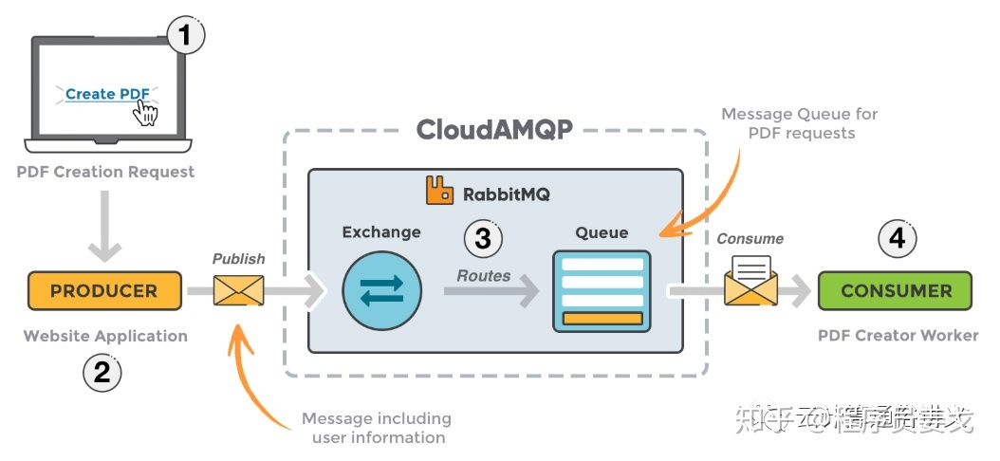
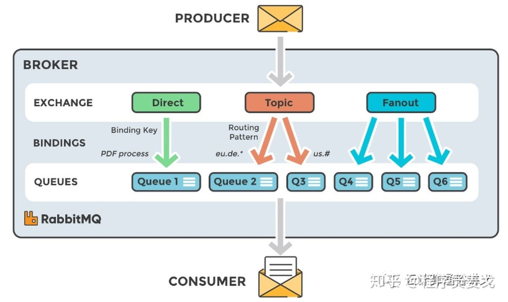

# 简介
RabbitMQ 是一套实现了高级消息队列协议(AMQP) 的开源消息代理软件。服务器使用 ErLang 语言编写的。它的集群和故障专转移是构建在开放电信平台框架上的。

## 组件与概念
RabbitMQ 核心概念包括 Publisher、Consumer、Server/Broker、Virtual host、Message、Exchange、Binding、Routing key、Connection、Channel、Queue 等。
- Publisher: 消息的生产者。向交换器 Exchange 发送消息的客户端应用程序。
- Consumer: 消息的消费者。表示一个从消息中取得消息的客户端应用程序。
- Server/Broker: 接受客户端的连接，实现 AMQP 实体服务。
- Virtual host: 虚拟地址，用于进行逻辑隔离，最上层的消息路由。一个 vhost 里面可以有若干个 Exchange 和 Queue。是 AMQP 概念的基础。
- Message: 消息，服务器和应用程序之间传送的数据，消息是不具名的，由 Properties 和 Body 组成(消息头和消息体)。
- Exchange: 交换机，接收生产者发送的消息，根据路由键转发消息到绑定的队列。常见的交换机类型有: direct(发布与订阅)、fanout(广播)、topic(主题)等。
- Binding: 绑定。Exchange 和 Queue 之间的虚拟连接，binding 中可以包含 routing key
- Routing key: 路由键。一个路由规则，虚拟机可以用它来确定如何路由一个特定消息。
- Connection: 连接，应用程序与 Broker 的 TCP 网络连接。
- Channel: 网络信道，是 TCP 里面的虚拟连接，几乎所有的操作都在 channel 中进行，是进行消息读写的通道。客户端可以建立多个 channel。
- Queue: 也称为 Message Queue(消费者创建)，消息队列，保存消息并将它们转发给消费者。它是消息的容器，也是消息的终点。消息在队列中直到消费者将其消费。

### 架构
RabbitMQ 的架构如下所示，生产者将消息发布到 RabbitMQ 集群，由 exchange 路由到 queue 中，等待消费者从 queue 中消费消息。

RabbitMQ 的交换机架构如下, 将通过不同类型的交换机将消息路由到指定的 queue 中:

### 特性
RabbitMQ 具有高并发、高性能、高可用、低延时等特性。

## AMQP
AMQP(Advanced Message Queuing Protocol) 高级消息队列协议是面向消息中间件提供的开放的应用层协议，设计目标是对于消息的排序、路由(包括点对点和订阅-发布)、保持可靠性、保证安全性。AMQP 规范了消息传递方和接收方的行为，以使消息在不同的提供商之间实现互操作性。

## 参考
1. [知乎 - RabbitMQ原理](https://zhuanlan.zhihu.com/p/281912931)