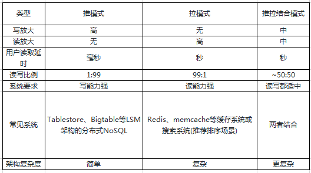

# 简介
针对高并发、亿级数据量的后台架构设计

## 同步
常见的同步模式三种: 
- 推模式(写扩散): 发送者发送一个消息后，立即将消息推送给接受者，接受者此时不一定在线，就需要有地方(同步库)存储数据。写扩散要求同步库的写入能力强。
- 拉模式(读扩散): 发送者发送消息后，不会立即推送给粉丝，而是写入自己的发件箱，粉丝上线后再去关注者的发件箱里读取。一条消息只会写入一次，但是读取数可能会和粉丝数一样大。读会放大，所以叫做读扩散。这种模式要求读取能力强。这种模式在产品前期数据量少的时候可以应付，当数据量大了就会事倍功半。
- 推拉结合: 在推模式中，一些大 V 的消息可能需要扩散几百万次，且用户中可能有一半是僵尸，不会上线，就会造成资源浪费。而拉模式的系统架构会较为复杂，用户量多了可能有故障产生。故可以采用推拉结合的模式，只有大 V 是读扩散，大部分用户是写扩散，这样既可以节省资源、又可以减少系统的复杂度。

下面是三种模式的对比:

## 设计原则
**可用性**: 在某个考察时间，系统能够正常运行的概率或时间占有率期望值.
**柔性可用**: 在条件有限而不能向用户提供完美服务时，可以以柔性的方式提供有损的服务.
**不信任原则**: 对输入不信任、对输出不信任、对服务不信任、对依赖系统不信任、对请求不信任.
当接入外部系统时, 如何提升系统的可用性.对于等待第三方回调时, 需要从不信任第三方回调可靠性的情况下设计业务系统.

## 一致性
一致性: 数据保持一致. 在分布式数据中指多个节点中的数据值是一致的.
ACID: 指事务的原子性(atomicity)、一致性(consistency)、隔离性(isolation)、持久性(durability).

## 异构
同构: 多个相同类型的物体参与完成某一件事情.
异构: 多个不同类型的物体参与完成某一件事情，异构系统的各个组成部分具有自身的自治性，实现数据共享的前提下，仍保留自己应用特性，完整特性，安全特性。

## 参考
1. [微博朋友圈亿级Feed流如何设计](https://www.phpmianshi.com/?id=30)
2. [设计数据密集型应用 - 中文翻译](https://vonng.gitbooks.io/ddia-cn/content/)
3. [后台必备意识——柔性可用](https://cloud.tencent.com/developer/article/1339887)
4. [程序世界里的不信任原则](https://cloud.tencent.com/developer/article/1005918)