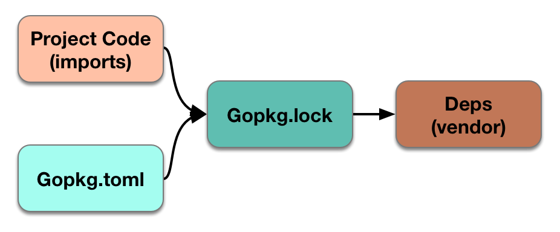
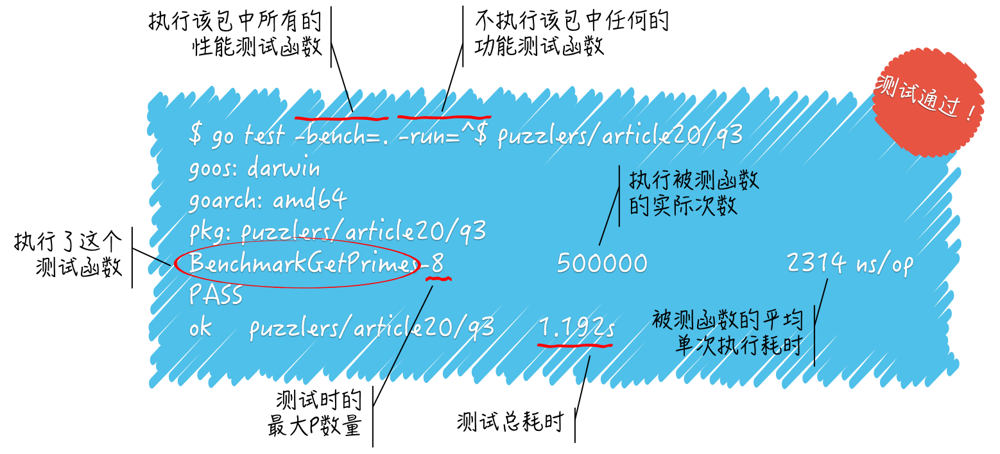
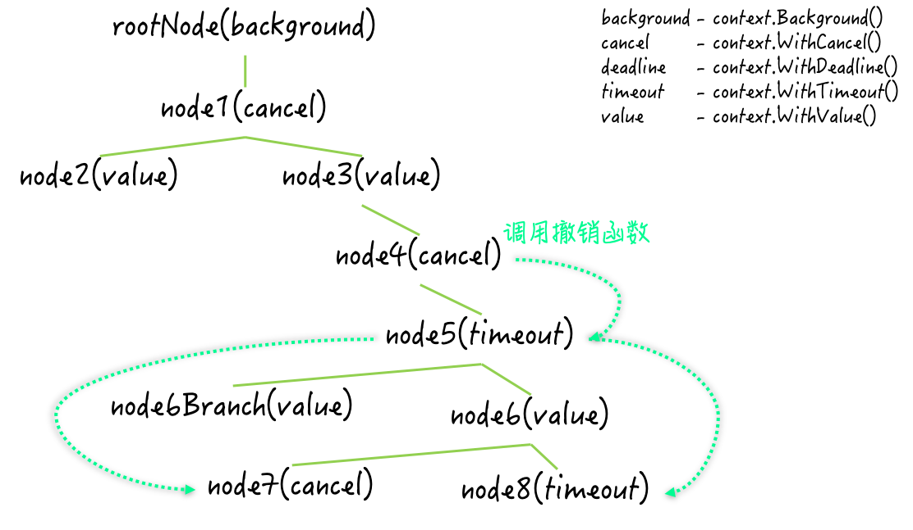

# vendor
用于支持本地包管理依赖，通过 vendor.json 文件记录依赖包版本，可以将项目依赖的外部包拷贝到项目下的 vendor 目录下。
### 命令
govendor init

govendor add +external

govendor list

govendor list -v fmt

govendor fetch golang.org/x/net/context@{version-id}

govendor fetch golang.org/x/net/context@v1

govendor fetch golang.org/x/net/context@=v1

govendor fetch golang.org/x/net/context

govendor fmt +local

govendor install +local

govendor test +local
  
# dep

### 命令
dep init

dep ensure

dep ensure -add 

dep check

dep status 

# 语言特性
1. 基础
+ 工作区和GOPATH
+ 命令源码文件、库源码文件
+ 关键字
   + go、range、channel、make、type
+ 变量、常量、函数、结构体、接口
    + **浅拷贝，值类型和引用类型**
    + 指针、uintptr、unsafe.Pointer、不可寻址值
    + 嵌入字段
    + 接口类型、动态类型、静态类型、**接口赋值**、**零值**、iface、无类型 nil
    + 常量默认类型
    + byte、uint8
    + value.(type)
    + **副本**
+ 类型推断、代码块、类型断言
+ 数组、切片
    + 切片的容量增长
+ container/list 包,指针
+ map(字典、键值对、键元素对、映射)
+ 通道 channel
    + make、<-、select case
    + FIFO 队列
    + 副本、复制
    + 缓冲通道、非缓冲通道
    + 单向通道、双向通道
    + 同步、异步
+ goroutine 协程
    + go 语句 
    + sync.Pool、sync.Map、sync.WaitGroup
    + CSP 并发模型
    + GPM (goroutine、processor、machine) 
    + runtime.GOMAXPROCS(maxProcs)
    + goroutine pool
    + struct{}{}
    + sync/atomic
    + > 怎样让我们启用的多个 goroutine 按照既定的顺序运行?
+ if、for、switch 语句
    + range、

+ **panic、recover、defer**
+ package
    + **error**
        + 卫述语句
        + error type
        + 错误处理
        + 立体的错误类型体系
        + 扁平的错误值列表
    + fmt
    + io.Writer
    + bufio
    + image

+ panic、defer、recover
    + panic
        + index out of rang
        + runtime error: index out of ra...
        + exit status 2
        + 从 panic 被引发到程序终止运行的大致过程是什么？
            1. 建立 panic 详情
            2. 沿着调用栈的反方向传播至顶端, main 函数
            3. go runtime 回收，程序崩溃
            4. 打印 panic 详情
        + 意外 panic, 主动 panic()函数
    + recover
    + defer
        + 不支持 go 语言内建函数调用
        + 不支持 unsafe 包中的函数的调用表达式
        + 倒序执行、FILO 队列（栈）
        + 可以在 defer 中引发 panic 么？

+ 测试
    + go 程序测试
        + 功能测试（test）
        + 基准测试（benchmark, 性能测试）
        
        + 示例测试（example）
        + go clean -cache
        + -cpu、-count、-parallel、-benchmark、-benchtime
        + GPM(Goroutine、Processor、Machine)
    + 程序监测
    + go 语言标准库代码用法
    + 单元测试、API 测试、集成测试、灰度测试

+ 互斥锁 sync.Mutex、sync.RWMutex
    + 竞态条件 (race condition)
    + 同步、临界区（critical section）、互斥量（mutual exclusion）
    + lock、unlock、deadlock
    + time.Ticker
    + 共享资源（存储、计算、I/O、网络等）
    + 互斥锁和读写锁的指针类型都实现了哪一个接口？（Lock接口）
    + 怎样获取读写锁中的读锁？（Rlock）

+ 条件变量 sync.Cond
    + 等待通知(wait)，wait 方法做了什么？
    + 单发通知(signal)
    + 广播通知(broadcast)
    + sendCond、recvCond
    + *sync.Cond类型的值可以被传递吗？那sync.Cond...

+ 原子操作 (sync/atomic)
    + sync/atomic 包提供了几种原子操作？可操作的数据类型又有哪些？
    + atomic.Value
    + 加法（Add）、比较并交换（compare and swap，简称 CAS）、加载（load）、存储（load）和交换（swap）
    + 原子操作减法（无符号数的减法）
    + CAS 比较交换操作相比交换操作有什么优势？
    + 自旋锁（spinlock）

+ sync.WaitGroup 和 sync.Once
    + sync.WaitGroup、Add、Done、Wait
    + GoF 单例模式
    + 在使用 waitgroup 值实现一对多的 goroutine 协作流程时，怎样才能让分发子任务的 goroutine 获得各个子任务的具体执行结果呢？

+ context.Context
    + context.Background、context.WithCancel、context.CancelFunc、context.WithDeadline、context.WithTimeout
    + 
    + context 值在传达撤销信号的时候是广度优先的，还是深度优先的？其优势和劣势都是什么？

+ 临时对象池 sync.Pool

## 为什么 go 语言没有继承

        面向对象编程，至少在最知名的语言中，涉及到太多关于类型之间关系的讨论，这些关系通常可以自动派生。而 Go 则采用了不同的方法。
        在 go 中，并不要求程序员提前声明两个类型是相关的，go 会自动满足指定其方法子集的任何接口。但这种方法真正的优势可不仅是减少记录。go 的类型可以同时满足多个接口，而不需要传统的多重继承的复杂性。接口可以是非常轻量的，具有一个甚至零个方法的接口就可以表示一个有用的概念。如果出现了新的需求或者用于测试，可以在实体之后直接添加接口，而不需要注释原类型。由于类型和接口之间没有明确的关系，所以也不需要管理或争论的类型层次结构。
        这些思想可以用于构建类似于类型安全的Unix管道的东西。例如，可以参考 fmt.fprintf 是如何格式化打印到任何输出而不仅是文件、bufio 包如何与文件 I/O 完全分离、image 包如何生成压缩文件。所有这些想法都源于用单个接口（io.writer）表示单个方法（write）。这些还只表面上，Go的接口对程序的结构还有着很深远的影响。
        熟悉这些需要一些练习习惯，但这种类型依赖的隐式风格是 Go 高效的事情之一。

> Why is there no type inheritance? https://golang.org/doc/faq#inheritance

# 内建函数
> close()
用于关闭 channel（双向或者只写的），将不在阻塞读取。如果 channel 关闭且没有值，读取 ok 将会为 false
> select case
1. 存在 default 不阻塞
2. 不存在 default 阻塞

# TCMalloc

# 垃圾回收
+ STW (Stop the World)
+ Mark STW，SWEEP 并行
+ 三色标记法
+ 写屏障( write barrier)

> 三色标记法
1. 所有对象最开始是白色
2. 从 root 开始找到所有可达对象，标记为灰色，放入待处理队列
3. 遍历灰色对象队列，将其引用对象标记为灰色放入待处理队列，自身标记为黑色
4. 处理完灰色对象队列，执行清扫工作

# struct tag
可以很方便的进行 json 、yaml 等文件的解析

# golang 问题
1. map、struct、切片在 64 位机器中占用多少字节

# ref
1. <a href="http://legendtkl.com/2017/04/28/golang-gc/">Golang 垃圾回收剖析</a>
2. <a href="https://www.jianshu.com/p/c4ec92afeca8">golang 自定义 struct 字段标签</a>
3. <a href="https://www.kancloud.cn/kancloud/effective/72199">Effective Go 中文版</a>
