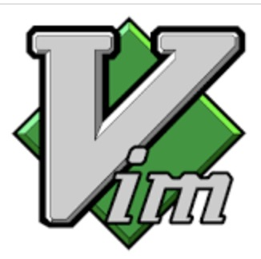

# 环境准备
在开始学习 go 语言之前，第一步当然是准备 go 的开发环境了. go 是一门跨平台开发语言，linux、mac、windows 都可以进行开发，并可编译生成对应平台上的可执行文件.

## Go 的安装与配置
**1. 下载与安装**

首先可以前往 go 中文社区 studygolang.com/dl 下载 go 相应平台的安装包. 并附有安装文档在 docs.studygolang.com/doc/install 页面. 安装完成后，可以执行 go 的命令进行检查, 如下:

    $ go version
    go version go1.13.4 darwin/amd64

**2.  GOPATH 环境配置**

安装完成后，在 GOROOT 目录下有 src、pkg、bin 等目录和文件，它们存储着 go 的核心源码库及编译后的文件、命令.  $GOROOT/bin 将会加入环境变量 PATH 中，目录下的可执行文件 go、gofmt 可以直接运行，以下是 $GOROOT 目录下的内容

    $ ls $GOROOT
    AUTHORS         CONTRIBUTORS    PATENTS         SECURITY.md     api             doc             lib             pkg             src
    CONTRIBUTING.md LICENSE         README.md       VERSION         bin             favicon.ico     misc            robots.txt      test

除了 $GOROOT、需要自己配置一个与 $GOROOT 目录不同的目录 $GOPATH. 它是一些用于 go 来查找包的目录列表, 在 GOROOT 里找不到的包，将从 GOPATH 中寻找. 将它设置的不同于 $GOROOT 可以避免污染 go 的源码文件，也便于后续更新 go 的版本，可以直接替换 $GOROOT.

$GOPATH 目录约定有三个子目录：
+ src 存放源代码（通过 go get 下载的 package）
+ pkg 编译后生成的文件（比如：.a）
+ bin 编译后生成的可执行文件（为了方便，可以把此目录加入到 $PATH 变量中）

**查看配置**
通过 go env 命令，可以查看当前版本的 go 的信息

    $ go env

## Go 命令
go 命令提供了许多编程需要用到的功能，如编译 go 工程的 go build，如下是一些项目开发中常用的命令:

    go build    // 编译工程代码
    go run      // 直接运行代码
    go test     // 执行测试代码
    go get      // 下载 Go 包
    go install  // 编译应用包
    go mod      // go 1.11 后加入的包管理工具
    go env      // 关于当前 go 的配置信息
    ...

## 编写 Hello World 程序
安装并配置好 go 之后，可以开始写一个 go 的 HelloWorld 程序了，代码如下:

    package main

    import (
        "fmt"
    )

    func main(){
        fmt.Println("Hello,World!)
    }

一个小小的 HelloWorld 程序也可以看出 go 的许多不同之处. 如入口 main 包、main 函数、标准库的引入、函数 func 等.

将上述代码保存为 demo.go , 就可以通过下述命令编译或直接运行了:

    $ go build demo.go
    $ ./demo
    $ go run demo.go

## 开发工具
一个好的开发 IDE，不仅能帮助快速进行代码开发，还可以统一编程风格、发现代码错误. 开发 golang 的 IDE 可以用 vim、vscode、goland

#### vscode
微软开发的功能强大的代码编辑器，是目前十分受欢迎的开发工具，它具有强大的插件扩展能力，几乎所有主流语言的开发，包括 go，只需要安装相应的插件即可.

可以通过 https://code.visualstudio.com 官网下载安装 vscode软件

#### goland
jetbrains 推出的 golang 的集成开发工具. jetbrains 推出了许多编程语言的编译如 PyCharm、WebStorm、PhpStorm 等.

可以在 https://www.jetbrains.com/go/ 下载及购买 goland.

#### vim
vim 作为经典的文本开发工具，被广泛应用. 十分轻量，功能也十分强大, 在没有图形界面的服务器中，是最常用的编辑器. 通过插件的配置，在图形化的 PC 中也占有一席之地. 

