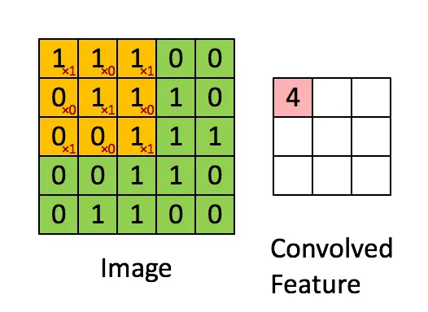

# 简介
统计学等数学知识.

## 统计学
统计学相关数学知识.
### 基础概念
- 显著性差异: 对数据差异性的评价, 当某次实验的结果在零假设下不大可能发生时, 就认为结果具有显著性差异.
- 显著性水平: 常用于假设检验中检验假设和实验结果是否一致, 它代表在零假设(记作 H0)为真时, 错误的拒绝 H0 的概率, 即发生第一类错误的概率.

## 深度学习
深度学习是仿照人脑建模的神经网络. 深度学习神经网络(或人工神经网络)是由计算机内部协同工作的多层人工神经元组成的. 深度学习是机器学习的子集, 是为了提高传统机器学习技术的效率.
- 输入层: 人工神经网络有几个向其输入数据的节点. 这些节点构成了系统的输入层.
- 隐藏层: 输入层处理数据并将其传递到神经网络中的更远层.
- 输出层: 输出层由输出数据的节点组成. 输出 "是" 或 "否" 答案的深度学习模型在输出层中只有两个节点.

### CNN 
卷积神经网络(CNN, Convolutional Neural Network) 是一种前馈神经网络, 它的神经元可以响应一部分覆盖范围内, 对大型图像处理有出色表现. 卷积神经网络在图像和语音识别方面的效果较好. 经典的 CNN 网络模型有 LeNet、AlexNet、VGG、GoogLeNet、ResNet、DenseNet. CNN 由卷积层.
- 卷积运算(convolution): 将图像矩阵中, 从左到右, 由上到下, 取与滤波器同等大小的部分, 每一部分中的值与滤波器中的值对应相乘后求和, 结果组成一个新的矩阵.

- 填充(padding): 为了避免输入图像与卷积核卷积后丢失部分边缘像素点, 对原矩阵的边缘进行填充.
- 步长(stride): 一般在滑动卷积时, 每次滑动一行或一列, 即 stride=1, 设置 stride=2 可以滑动 2 行、列, 这样可以压缩一部分信息.
- 卷积核大小(kernel size): 卷积核大小一般为奇数, 常见的是 1*1、3*3、5*5、7*7. 奇数的卷积核更容易 padding 和找到卷积锚点.
- 滤波器通道数: RGB 图像有三个通道. 一般卷积核滤波器通道数为上一层特征图的通道数. 输出特征图的通道数为滤波器 filter 的数量.

#### LeNet 
LeNet 是最早的卷积神经网络之一, 主要用于识别手写数字和机器印刷字符. 算法通过连续使用卷积和池化层的组合提取图像特征.

在泛函分析中, 卷积(convolution)是透过两个函数 f 和 g 生成第三个函数的一种数学算子, 表征函数 f 与经过翻转和平移的 g 的乘积函数所围成的曲边梯形的面积. 如果将参加卷积的一个函数看作区间的指示函数，卷积还可以被看作是”移动平均“的推广.

#### AlexNet
AlexNet 是一个卷积神经网络, 它是首个用于图像分类的深层卷积神经网络.
AlexNet 包含八层, 前五层是卷积层, 之后一些是最大池化层, 最后三层是全连接层. 它使用了非饱和的 ReLU 激活函数, 显示出比 tanh 和 sigmod 更好的训练性能.

### Transformer
Transformer(变换器) 是一种采用自注意力机制的深度学习模型, 这一机制可以按输入数据各部分重要性的不同而分配不同的权重. 模型主要用于自然语言处理(NLP)和计算视觉(CV)领域. Transformer 模型在 2017 年由谷歌大脑的一个团队推出, 并逐步取代了 LSTM 等 RNN 模型成为了 NLP 问题的首选模型.

### 激活函数
激活函数用于为神经网络增加非线性因素, 解决线性模型表达能力不足的缺陷.
- sigmoid: 取值 (0,1), 单调连续, 一般用于隐藏层和二分类的输出层.
- softmax: 通常是位于多分类任务的激活函数, 作用是将 CNN 的输出映射到一个概率分布, 使得每个概率值都在 (0, 1) 之间, 且所有类别的概率和为 1. 指数的 softmax 函数可以将差距大的数值拉的更大, 但可能导致计算溢出.
- ReLU: 线性整流函数, 通常指代以斜坡函数及其变种为代表的非线性函数.

### 损失函数
损失函数或成本函数是指一种将一个事件映射到一个表达与其事件相关的经济成本或机会成本的实数上的一种函数.

## MINIST 数据集
MNIST(Modified National Institute of Standards and Technology database)是一个大型手写数字数据库, 常用于训练各种图像处理系统和机器学习模型. 它被广泛用于训练和评估图像分类任务中的深度学习模型, 如卷积神经网络(CNN)、支持向量机(SVM) 和其它各种机器学习算法.

## 参考文献
1. [百度百科 - ReLU 函数](https://baike.baidu.com/item/ReLU%20函数/22689567)
2. [CNN基础知识——卷积（Convolution）、填充（Padding）、步长(Stride)](https://zhuanlan.zhihu.com/p/77471866)
3. [【图像分类】 一文读懂AlexNet](https://juejin.cn/post/7012922205965287432)
4. [Model Zoo](https://github.com/BVLC/caffe/wiki/Model-zoo)
5. [深度学习之快速理解卷积层](https://zhuanlan.zhihu.com/p/59917842)
6. [一文详解Softmax函数](https://zhuanlan.zhihu.com/p/105722023)
7. [凯斯西储（CWRU）数据集解读并将数据集划分为10分类（含代码）](https://zhuanlan.zhihu.com/p/437791143)
8. [【论文解读】Transformer: Attention is all you need](https://zhuanlan.zhihu.com/p/343751830)
9. [wikipedia - 损失函数](https://zh.wikipedia.org/zh-cn/损失函数)
10. [Convolution Layer](https://caffe.berkeleyvision.org/tutorial/layers/convolution.html)