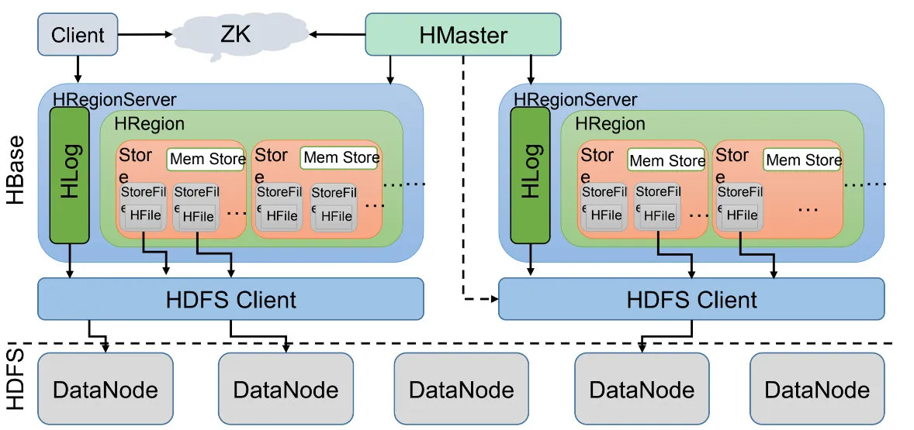

# 简介
Apache Spark 是开源集群运算框架.允许用户将资料加载至集群存储器内，并进行多次查询，十分适合机器学习算法.它主要使用内存中的缓存和优化的查询执行方式，可针对任何规模的数据进行快速分析查询，提供 java、python 等语言 API.支持跨多个工作负载重用代码，包括批处理、交互式查询、实时分析、机器学习和图形处理等.

## 基础概念
工作负载:
- 平台基础 Spark Core: 负责内存管理、故障恢复、计划安排、分配与监控作业，以及和存储系统进行交互.
- 交互查询 SparkSQL: 低延迟交互式查询的分布式查询引擎，速度可比 MapReduce 快 100 倍.
- 实时分析 Spark Streaming: 利用 Spark Core 的快速计划功能流式分析的实时解决方案.
- 机器学习 Spark MLib: MLib 是在大规模数据上进行机器学习所需的算法库.算法包括分类、回归、集群、协同过滤和模式挖掘等功能.
- 图形处理 Spark GraphX: GraphX 是构建在 Spark 上的分布式图形处理框架. 提供 ELT、探索性分析和迭代图形计算，让用户能够以交互方式大规模构建、转换图形数据结构.

- Spark RDD: 是一种数据存储集合.只能由它支持的数据源或是其它 RDD 经过一定的转换产生.在 RDD 上可以执行的操作有两种转换和行动，每个 RDD 都记录了自己如何由持久化存储的源数据计算得出的，即血统.
- HDFS: 适合存储大文件存储的分布式文件系统. 
- HBase: Hbase 是 Hadoop 数据库, 一个分布式、可伸缩的大数据存储. Hbase 是在 HDFS 的基础之上构建的.
    + 列式存储(RowKey): 充当了主键的作用, 可以唯一的标识一行记录.

### HDFS
hdfs 是适合存储大文件的分布式文件系统, 是 hadoop 的核心组件.
- 进程: NameNode、Secondary NameNode、DataNode、JournalNode、JobTracker、TaskTracker
- 读流程: 首先与 NameNode 通信查询元数据, 找到文件块所在的 DataNode 服务器. 挑选一台 DataNode , 建立 Socket . DataNode 发送数据. 客户端接受以 packet 为单位的数据, 先本地缓存、再写入文件.
- 写流程: 首先客户端发消息给 NameNode 请求上传并由NameNode 检查是否可上传. NameNode 根据感知策略返回 3 个 DataNode 节点, 3 个 DatNode 逐级应答客户端, 完成通信管道建立. 客户端对文件切片再开始分片上传 Block.
- 多副本放置策略: 第一个副本放置在本地节点或者磁盘及 CPU 状况好的节点. 第二个副本放置在不同的机架节点. 第三个副本放在与第二个相同机架的不同节点. 更多副本则随机存放.
- 存储格式: 行存储、列存储. 
    + 行存储: 一次完成写入, 写入优势大. 但是读取数据时若只需要某列的数据, 也需读取整行数据, 同时需要解析数据, 消耗较多 CPU, 增加耗时.
    + 列存储: 需要将一行数据拆分成多列进行存储, 写入次数多, 写入耗时大. 但读取时只需返回对应列的数据.
- 安全模式: 主节点启动时进入安全模式, 进行检查. 安全模式下只接受读数据, 不接受删除、修改等变更请求.
- HDFS 负载均衡: Hadoop 中的 HDFS 集群很容易出现机器之间磁盘利用率不平衡情况. 如集群内新增、删除节点、节点机器内硬盘存储达到饱和值. 数据不平衡时会导致网络带宽消耗. 当 HDFS 负载不均衡时, 需要对 HDFS 文件进行数据的负载均衡调整, 均衡 IO 性能、防止热点发生. 
    + Rebalance: 利用 hdfs 命令可以启动 rebalance. 将可以在不平衡节点间迁移数据.
    + threshold: 是否平衡的阈值. 理论上阈值越小, 集群越平衡. 
    + 负载均衡过程: 数据均衡算法, 通过 Rebalance Server 计算 DataNode 磁盘使用情况, 确定需要移动及接受数据的机器, 计算数据库迁移路线, 确保网络最短路径, 完成移动并删除本地 block. 向 Rebalance Server 确认数据库迁移, 这个过程直到达到集群平衡为止.
- 存储策略: 包括 Lazypersist、ALL_SSD、One_SSD、Hot、Warm、Cold 等.
- 异构存储: 支持将数据存储在访问性能更高的存储介质如内存或 SSD 上, 提升读写性能. 支持 ARCHIVE、DISK、SSD、RAM_DISK.
- HA: HDFS HA 只允许一个活动的 NameNode. HA 架构一般设置两个 NN, 一个处于活跃状态, 另一个处于待命状态. 
- 联邦机制: 通过多个相互独立的 NN, NN 分别负责自己所属的目录, 不需要彼此协调. HDFS 联邦拥有多个独立的命名空间, 每个命名空间管理属于自己的一块.

### yarn
yarn 是一个资源调度平台，负责为运算程序提供服务器运算资源，相当于分布式的操作系统平台.
### PySpark
pyspark 提供 Spark 的 Python API，能够通过 python 操作 RDDs. Py4j 库允许 python 动态的操作 JVM 的对象.

### 表
- 基本表: 独立存在的表, 在 SQL 中一个关系对应一个表.
- 中间表: 用来兼容数据, 建立映射关系, 兼容新老数据表的数据. 一般是实体之间存在多对多的关系时, 创建一个中间表给实体建立联系. 中间表主要和 OLAP 业务有关, 主要是由于计算逻辑复杂、查询性能差、ETL 过程转存、多样性数据源混合计算等原因造成.
- 临时表: 
- 数据运营层(ODS): Operation Data Store 数据准备区, 也称为帖源层. 数据仓库源头系统的数据表通常会原封不动的存储一份, 称为 ODS 层, 是后续数据仓库加工数据的来源. 
- 数据仓库层(DW): DW 数据分层由下到上为 DWD、DWB、DWS.
    + 细节数据层(DWD): data warehouse details 细节数据层, 是业务层与数据仓库的隔离层. 主要对ODS数据层做一些数据清洗和规范化的操作.
    + 数据基础层(DWB): data warehouse base 数据基础层, 存储的是客观数据, 一般用作中间层, 可以认为是大量指标的数据层.
    + 数据服务层(DWS): data warehouse service 数据服务层, 基于DWB上的基础数据, 整合汇总成分析某一个主题域的服务数据层, 一般是宽表. 用于提供后续的业务查询, OLAP分析, 数据分发等.
- 数据服务层/应用层(ADS): Application DataService 应用数据服务, 该层主要是提供数据产品和数据分析使用的数据, 一般会存储在 ES, MySQL 等系统中供线上系统使用.

## Hbase
Hbase 是一个 NoSQL 数据库, 一般用来存储海量的数据, 它基于 HDFS 分布式文件系统构建, Hbase 的一行记录由一个 RowKey 和一个或多个的列以及它的值.
- **hadoop**: 是一款支持数据密集型分布式应用程序的开源软件, 基于 MapReduce 计算模型, 为大数据的分布式储存与处理提供了软件框架. hadoop 核心模块包括分布式文件系统 hdfs、MapReduce 计算模型两个.
- **hdfs**: 分布式文件系统(Hadoop Distributed File System), 是一个高度容错性系统, 适合部署在廉价的机器上. 适合具有超大数据集的应用程序. 
- **MapReduce**: 分布式运算程序框架, 用于在 Hadoop 中编写分布式程序. 通过 Map、Reduce 两步完成大规模分布式计算.

### 性能

## 大数据
大数据 Big Data 指传统数据处理软件不足以处理的大或复杂数据集的术语. 
- IBM 5V 特点: Volume(大量)、Velocity(高速)、Variety(多样)、Value(低价值密度)、Veracity(真实性)
- 技术栈: Spark、Storm、Flikn、MapReduce、Hive、HBase、Kudu、HDFS、Yarn、Mesos、Kubernetes、Logstash、Kafka、Pulsur、Zookeeper 等

### Hive 
Hive 是基于 Hadoop 的数据仓库工具, 用来进行数据提取、转化、加载, 是一种可以存储、查询和分析存储在 hadoop 中的大规模数据的机制. 它可以将结构化的数据文件映射为一张数据表, 提供 SQL 查询功能, 能将 SQL 语句转变为 MapReduce 任务来执行. 
- **查询引擎**: 负责执行 SQL 语句.
- **元存储**: 在 HDFS 中将数据收集虚拟化表.

## 参考资料
1. [SparkSQL并行执行多个Job的探索](https://cloud.tencent.com/developer/article/1901879)
2. [AWS: 介绍 Apache Spark](https://aws.amazon.com/cn/big-data/what-is-spark/)
3. [Spark on Kubernetes 与 Spark on Yarn 不完全对比分析](https://www.infoq.cn/article/7cmvdianctkck4birhvi)
4. [Difference Between HDFS and HBase](https://www.educba.com/hdfs-vs-hbase/)
5. [中间表是什么？和报表有什么关系？会带来怎样的问题？又如何解决？](https://zhuanlan.zhihu.com/p/148782827)
6. [数据仓库分层中的ODS、DWD、DWS](https://www.cnblogs.com/amyzhu/p/13513425.html)
7. [腾讯云 -【万字长文】HDFS最全知识点整理（建议收藏）](https://cloud.tencent.com/developer/article/2005288)
8. [百度百科 - hive](https://baike.baidu.com/item/hive/67986)