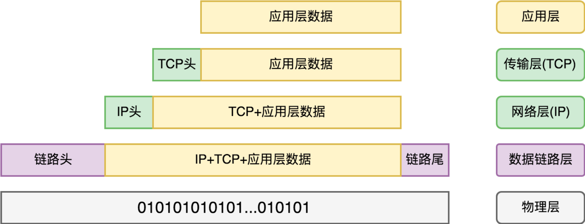
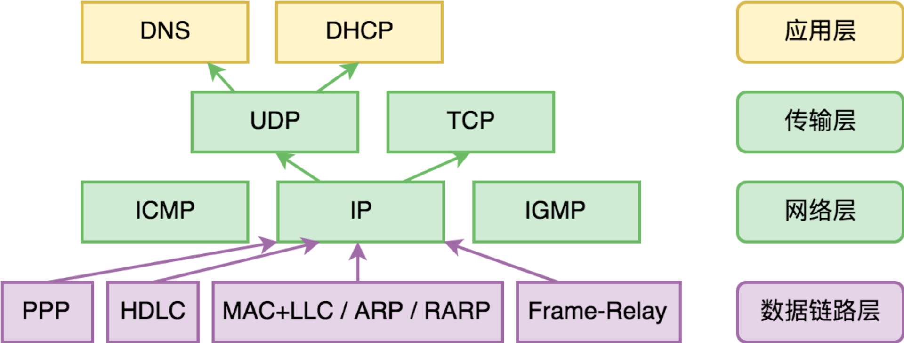

# 计算机网络

## OSI 七层网络模型

## 网络协议

网络协议为计算机网络中进行数据交换而建立的规则、标准或约定的集合.

+ 数据传输过程

+ 异构网络的封包转换问题
+ 网络应用程序视图
    - 数据链路层即 MAC 层，它解决的是局部网络的数据传输能力，如固网、WiFi、3G/4G/5G等

- 1. ARQ 协议是属于哪一层的协议？（链路层？传输层？）
- 2. 数据链路层如何确保帧的顺序？ARQ 协议如何确定重传的帧？