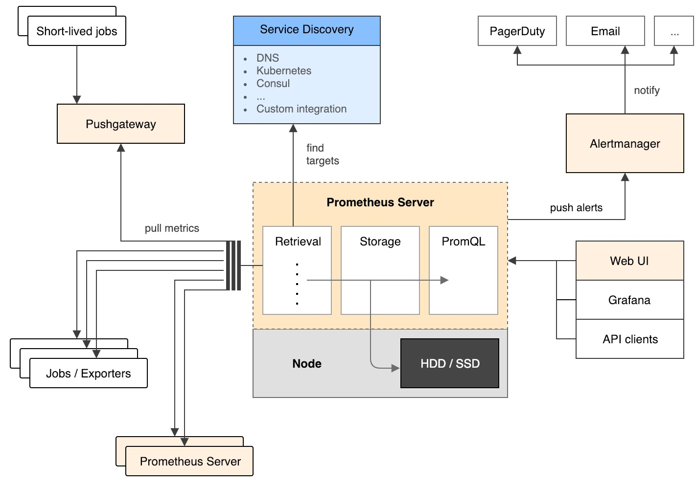
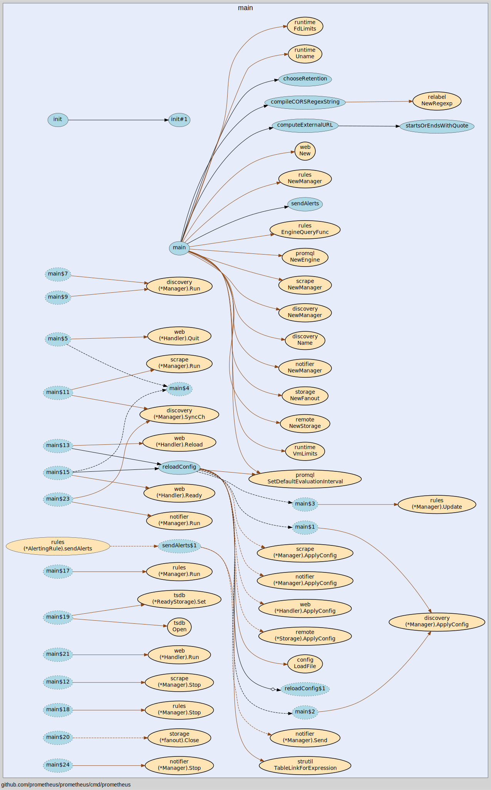
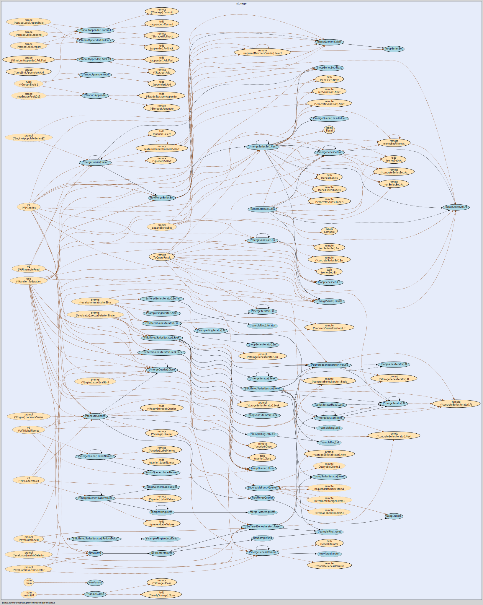

# prometheus
CNCF 的一个工程，是一个系统和服务监控工具。它从配置的目标中在采集 metrics.

## 特性
+ 多维度数据模型
+ 灵活的查询语句
+ 不依赖分布式存储，节点自治
+ 基于 HTTP 的 pull 模式采集时序数据
+ 支持 push gateway 实现 push 模式
+ 可以使用动态服务发现或静态配置寻找目标机器
+ 支持多种图形及仪表盘
+ 联邦集群

# 源码结构
> https://github.com/prometheus/prometheus

## 目录结构及 go 代码量统计

        ├── CHANGELOG.md
        ├── CONTRIBUTING.md
        ├── Dockerfile  
        ├── LICENSE
        ├── MAINTAINERS.md
        ├── Makefile
        ├── Makefile.common
        ├── NOTICE
        ├── README.md
        ├── RELEASE.md
        ├── VERSION
        ├── cmd                     2573
        ├── code-of-conduct.md
        ├── config                  1520
        ├── console_libraries
        ├── consoles
        ├── discovery               12006
        ├── docs
        ├── documentation           2135
        ├── go.mod
        ├── go.sum
        ├── notifier                1224
        ├── pkg                     4994
        ├── prompb                  4721
        ├── promql                  10993
        ├── relabel                 538
        ├── rules                   2591
        ├── scrape                  3949
        ├── scripts                 25
        ├── storage                 4631
        ├── template                642
        ├── util                    2675
        ├── vendor
        └── web                     5526
                                    60293

## 结构图

+ prometheus server 主要包括服务发现、存储、PromQL

## 组件
> github.com/oklog/run
一个通用机制用于管理 gorotuine 生命周期。可以同步并发运行多个函数，当有任意一个退出时，通知所有并发的函数退出，等待都退出成功后，返回错误并退出程序.
+ 启动信号量管理
+ 启动 discoveryManagerScrape
+ 启动 discoveryManagerNotify
+ 启动 scrape manager
+ 启动 Reload handler, 动态加载 config
+ 启动初始化配置
+ 启动 rule manager
+ 开启 tsdb
+ 启动 web
+ 启动 notifier manager

## remote storage
> 通过实现 remote_write/remote_read adapter 的接口，可以将 prometheus 持久存储到第三方存储如 opentsdb、influxdb、graphite 等数据库中. 在 documentation/examples/remote_storage中有实现这三个 adapter.

# ref
1. https://yunlzheng.gitbook.io/prometheus-book/part-ii-prometheus-jin-jie/readmd/scale-prometheus-with-federation